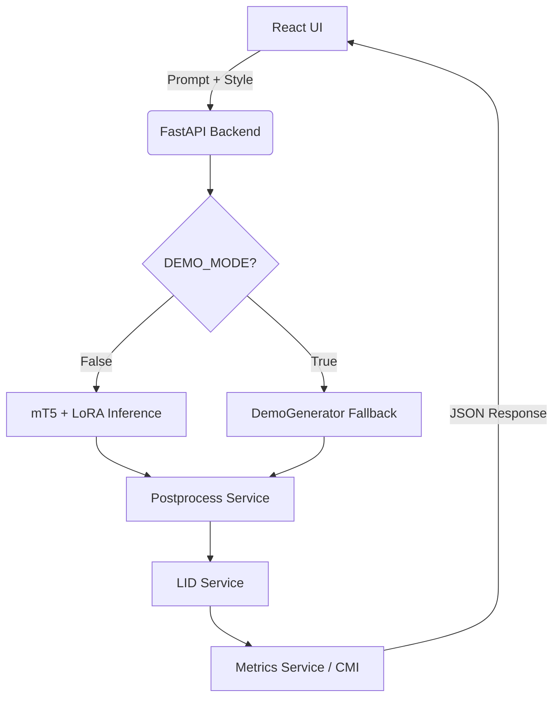

# TriMixGen 🚀

<div align="center">
  
  
  
  
  
</div>

---

## 📌 Project Overview
**TriMixGen** is an end-to-end AI application that generates natural **Telugu-English code-mixed text** written in Roman script. It provides an intuitive frontend to generate text based on specific domains, calculates the Code Mixing Index (CMI) of the output, and highlights token-level Language Identification (LID) in real-time.

> [!WARNING]
> **DEMO MODE ACTIVE:** The current public release utilizes a heuristically-driven `DemoGenerator` because the massive `mT5` + `LoRA` adapter model weights have not yet been trained or pushed to this repository. The application functions flawlessly to demonstrate the UX, API structure, LID tagging, and CMI calculations. 

## 🚨 Problem Statement
While modern LLMs excel at monolingual generation, they struggle profoundly with **Code-Mixed Language** (the fluid alternation between two or more languages). For Telugu-English specifically, this is compounded by the fact that users type Telugu in **Roman script** (transliteration) rather than native Telugu script. TriMixGen solves this by forcing boundary conditioning and specialized generation pipelines to output high-quality, authentic transliterated Telugu-English text suitable for chatbots, social media analysis, and NLP research.

## ✨ Features
- **Code-Mixed Text Generation:** Generates fluent Telugu-English romanized text.
- **Hybrid LID Tagging:** $O(1)$ dictionary lookups + Morphological suffix extraction + Named Entity Recognition (NER) for lightning-fast, highly accurate token labeling.
- **Code Mixing Index (CMI):** Automatically calculates the CMI (a standard NLP metric for code-mixing complexity) for every generated output.
- **Dynamic Token Inspector:** Hover over words to see their predicted language (`EN`, `TE`, or `OTHER`).
- **Prompt Gallery & History:** One-click domain templates and robust local history persistence.
- **Export:** Export generated texts to TXT or JSON format.

## 🏗️ Architecture



## 📁 Folder Structure
```text
TriMixGen/
├── backend/       # FastAPI application & Services
├── frontend/      # React Vite application
├── src/           # Core ML source code
├── configs/       # Configurations (LID dictionaries, Prompts)
├── data/          # Data pipelines (Excluded from Git)
├── docs/          # Documentation
├── scripts/       # Training, Benchmarking, Data scripts
├── tests/         # Unit and Integration tests
├── models/        # Model definitions
└── outputs/       # Experiment logs & models (Excluded from Git)
```

## 🛠️ Tech Stack
- **Frontend:** React 19, Vite, Tailwind CSS, Lucide React, Axios.
- **Backend:** FastAPI, Uvicorn, Pydantic V2.
- **Machine Learning Pipeline:** PyTorch, Hugging Face Transformers, PEFT (LoRA).

## 🚀 Installation & Setup

### 1. Clone the repository
```bash
git clone https://github.com/abhiram073/TriMixGen.git
cd TriMixGen
```

### 2. Backend Setup
```bash
# Create and activate virtual environment
python -m venv .venv
source .venv/bin/activate  # On Windows: .\.venv\Scripts\Activate.ps1

# Install dependencies
pip install -r requirements.txt

# Configure Environment
cp .env.example .env

# Run FastAPI Server
uvicorn backend.app:app --host 0.0.0.0 --port 8000 --reload
```

### 3. Frontend Setup
```bash
cd frontend

# Install dependencies
npm install

# Run Vite Dev Server
npm run dev
```

## ☁️ Deployment (Render)

TriMixGen is configured to deploy as a **unified single-service architecture** on [Render](https://render.com). The FastAPI backend serves both the API routes and the compiled React frontend, which avoids CORS issues and minimizes resource usage.

1. Go to your [Render Dashboard](https://dashboard.render.com).
2. Click **New +** and select **Blueprint**.
3. Connect your GitHub repository.
4. Render will automatically detect the `render.yaml` file and deploy the unified `trimixgen-service`.

## 🧪 Testing
```bash
# Run backend tests
pytest backend/tests/ -v
```

## 🔮 Future Roadmap
1. Train the `mT5-small` model using LoRA on high-quality code-mixed datasets.
2. Publish model weights to Hugging Face Hub.
3. Toggle `DEMO_MODE=False` to activate true ML inference.
4. Expand LID Service with an ONNX-quantized Transformer model.

## 🤝 Contributors
Built for open-source AI research and modern web development portfolios. Pull requests and issues are welcome!

## 📜 License
This project is licensed under the MIT License - see the [LICENSE](LICENSE) file for details.