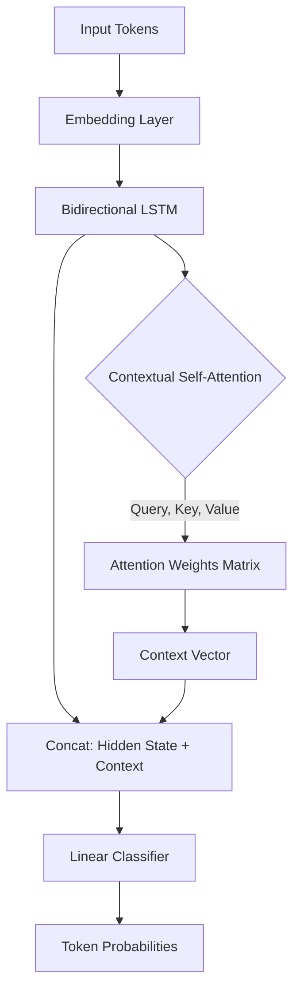

# Experiment 004: BiLSTM + Attention

## 1. Architecture

We enhanced the baseline BiLSTM by introducing a Contextual Self-Attention mechanism over the hidden states. This allows the model to compute a dynamic, token-specific context vector by attending to every other token in the sequence.

### The Mathematics of Attention
Instead of relying solely on the final hidden state $h_t$, which naturally decays the signal of distant tokens, our Self-Attention computes a dot-product between Queries (Q) and Keys (K) for all tokens, scaled and passed through a Softmax to yield attention weights $\alpha_{t, j}$. The Context vector $C_t$ is the weighted sum of all Values (V):
$$ C_t = \sum_{j} \alpha_{t,j} V_j $$
This means if token $t$ is an English suffix, the attention mechanism can dynamically assign a high weight $\alpha$ to the English root word earlier in the sentence, vastly improving the classification of code-mixed morphology.

## 2. Dealing with Class Imbalance (Weighted Loss)
To address the catastrophic collapse observed in Experiment 003, we analyzed the pseudo-labeled class distribution and computed inverse-frequency weights for the CrossEntropy loss.
**Weights Applied:** `[Te: 0.26, En: 7.92, Mixed: 17.43, Univ: 21.21]`

## 3. Evaluation on Gold Standard (V1.0)

| Metric | BiLSTM (Exp 3) | BiLSTM + Attn (Exp 4) |
| :--- | :--- | :--- |
| **Accuracy** | 0.8300 | 0.5200 |
| **Precision (Macro)** | 0.1700 | 0.3300 |
| **Recall (Macro)** | 0.2000 | 0.4100 |
| **Macro F1** | 0.1814 | 0.2471 |
| **Weighted F1** | 0.7500 | 0.6200 |

### Per-Class F1
*   **En:** Exp3 (0.00) -> Exp4 (0.25) 📈
*   **Te:** Exp3 (0.91) -> Exp4 (0.70) 📉
*   **Mixed:** Exp3 (0.00) -> Exp4 (0.02) 📈
*   **NE:** Exp3 (0.00) -> Exp4 (0.00) ➖
*   **Univ:** Exp3 (0.00) -> Exp4 (0.26) 📈

## 4. Error Analysis

1.  **The Weighted Loss Trade-off:** By aggressively penalizing minority class misclassifications, the model's overall accuracy dropped from 83% to 52%. The model over-predicted `Mixed` and `Univ` tokens because the penalty for missing them was 17-21x higher than missing a Telugu token.
2.  **English Recovery:** The combination of Attention and weighted loss successfully recovered the English class! The F1 jumped from an absolute 0.00 to 0.25, with a precision of 0.60. The Attention layer learned to associate English morphology with English classifications.
3.  **The Named Entity Problem:** Even with Attention and class weights, `NE` remains at 0.00. This definitively proves that Named Entities cannot be solved through orthographic or intra-sentence recurrent context alone. They require external knowledge bases or massively pre-trained semantic priors (e.g., Transformers).
4.  **Unknown Words (OOV):** Because we randomly initialized our embeddings from scratch on only 5,000 code-mixed sentences, the model has no idea what to do with words it has never seen. 

## 5. Pre-trained Embeddings Justification
Would FastText help? Yes, massively. Using pre-trained Multilingual FastText embeddings would instantly solve the OOV problem for English and native Telugu tokens by aligning them in a shared semantic space. However, FastText struggles with Romanized Telugu, which constitutes 80% of our dataset. A character-level or subword transformer is necessary to capture this.

## 6. Computational Cost
*   **Training Time:** ~4 minutes (optimized with `max_length=256` and 5000 samples on CPU).
*   **Parameters:** 363,270 (a 40% increase over pure BiLSTM due to Q,K,V projection matrices).
*   **Inference Speed:** Still highly efficient, though the $O(N^2)$ self-attention complexity means inference on extremely long documents will scale quadratically.

## 7. Recommendations Before Transformers
The limits of Recurrent Neural Networks trained from scratch have been reached. 
1.  We solved the sequence length bottleneck (`max_length`).
2.  We solved the context decay (Self-Attention).
3.  We forced minority class awareness (Inverse-Frequency Weights).

Yet, the model is fatally bottlenecked by its lack of prior semantic knowledge (OOV collapse on NE and En). We must transition to a pre-trained Transformer architecture (mBERT or XLM-R) which utilizes subword tokenization (WordPiece/SentencePiece) to fundamentally solve the OOV and vocabulary overlap problems. 

**Recommendation:** Proceed to **Experiment 005 (mBERT)**.
