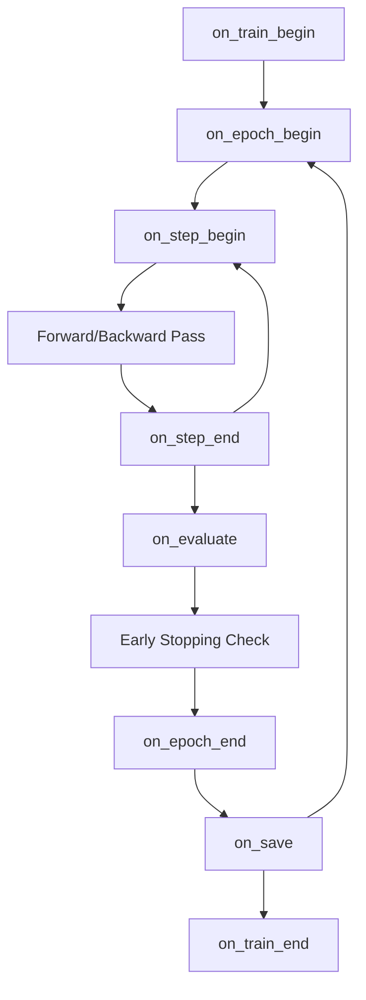

# Callback Design & Architecture: TriMixGen

This document outlines the callback architecture integrated into the `Seq2SeqTrainer` for the TriMixGen code-mixed generation pipeline.

## 1. Callback Architecture in Hugging Face
The Hugging Face `Trainer` uses an Event-Driven Architecture. Rather than hardcoding logging, profiling, or stopping logic directly into the massive training loop, the `Trainer` fires specific "Events" at various stages. A `TrainerCallback` listens for these events and executes its logic independently.

## 2. Event Lifecycle
The callback lifecycle operates hierarchically:
*   `on_train_begin`: Fired once. Used to initialize TensorBoard writers, open log files, and record baseline RAM.
*   `on_epoch_begin` / `on_epoch_end`: Fired around every epoch. Used for measuring `epoch_time` and triggering evaluations.
*   `on_step_begin` / `on_step_end`: Fired every time a batch is processed and weights are updated (or gradients accumulated). Used for high-frequency logging like `learning_rate` and `gradient_norm`.
*   `on_evaluate`: Fired after a validation pass. Used by Early Stopping to check if the model is degrading.
*   `on_save`: Fired when a checkpoint is written to disk.
*   `on_train_end`: Fired once. Closes file handles, flushes TensorBoard, and generates final summary reports.

### Lifecycle Diagram

## 3. Why Callbacks Improve Modularity
By offloading auxiliary tasks (like measuring RAM or writing to TensorBoard) into isolated callback classes, the core `trainer.py` module remains incredibly clean. If we ever want to switch from TensorBoard to Weights & Biases (W&B), we simply swap the callback injection. We do not have to touch the mathematical training loop at all.

## 4. Early Stopping and Overfitting
Code-mixed datasets are inherently small (e.g., Alpaca translated to Telugu). A 300M parameter model will quickly memorize the training data, pushing the training loss toward 0 while the validation loss begins to spike. **Early Stopping** acts as a circuit breaker. By monitoring `eval_loss`, it stops the training loop if the validation loss hasn't improved for $N$ consecutive epochs (the `patience` parameter), inherently preventing overfitting.

## 5. The Problem with Validation Loss in Generation
While `eval_loss` (Cross-Entropy) is a good proxy for early stopping, it is **insufficient** for generation tasks. Cross-Entropy measures whether the model correctly predicted the *exact next token* from the training dataset.
However, in Code-Mixing, "I went to the store" could be:
*   "Nenu store ki vellanu" (pure Telugu)
*   "Nenu store ki vella" (colloquial)
*   "I vellanu to the store" (poor code-mixing)
If the model outputs a perfectly valid code-mixed phrase that differs slightly from the ground truth, Cross-Entropy heavily penalizes it. Therefore, we rely on callbacks for loss, but Phase 8 (Evaluation) will rely on generative metrics (BLEU, CMI, ROUGE) to truly judge quality.
