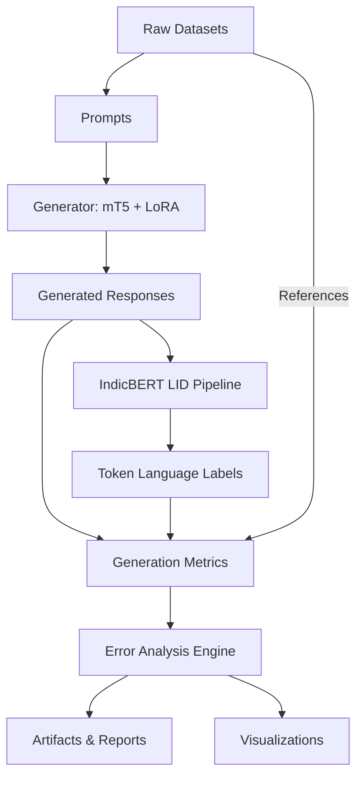

# Evaluation Pipeline: TriMixGen Generation Module

This document outlines the architecture, workflow, and integration of the final Generation Evaluator.

## 1. Architecture Diagram

## 2. Evaluation Workflow
The evaluator acts as the supreme orchestration layer.
1.  **Ingestion:** Accepts a batch of inputs (prompts and optional references).
2.  **Generation:** Calls the `TriMixGeneratorModel` (coupled with its configuration and LoRA adapters) to auto-regressively generate text.
3.  **LID Tagging:** Passes the generated text into the pre-trained `IndicBERT` pipeline to extract token-level language identification tags (`EN`, `TE`, `OTHER`).
4.  **Metric Computation:** Feeds the predictions, references, and LID tags into the pure mathematical `GenerationMetrics` library.
5.  **Error Categorization:** Automatically scans the outputs to flag monolingual collapse, repetitive loops, or script hallucinations based on heuristic thresholds.
6.  **Reporting:** Dumps the structured artifacts (`predictions.csv`, `metrics.json`) and visualization histograms to disk.

## 3. Metric Dependencies
The pipeline is designed with graceful degradation:
*   **Generation Only:** If no references are provided (e.g., live user inference), BLEU, ROUGE, and BERTScore are skipped. Diversity metrics (Distinct-1, Self-BLEU) are calculated.
*   **Without IndicBERT:** If the LID model is unavailable, Code-Mixing Index (CMI) is skipped, but all other semantic and lexical evaluations proceed.

## 4. Computational Complexity
*   **mT5 Inference:** $O(N \times V)$ where $N$ is generation length and $V$ is vocabulary size. This is the bottleneck.
*   **IndicBERT Tagging:** $O(N^2)$ due to Self-Attention, but extremely fast because sentence lengths are short and it is only run once per generation.
*   **Metrics:** $O(N)$ for most, $O(N^2)$ for BERTScore/Self-BLEU.

## 5. Deployment Integration
This evaluator is designed to be directly imported by the final API server in Phase 8. It can run in `standalone` mode to validate user prompts in real-time or in `batch` mode to grade the entire TriMixGen test set overnight.
