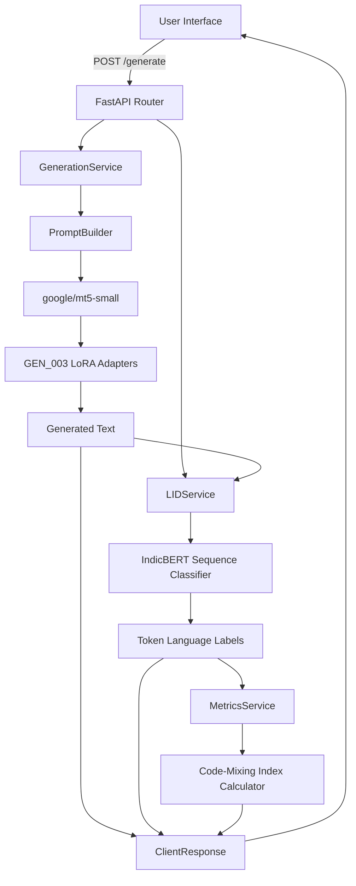

# TriMixGen System Architecture

## End-to-End Pipeline

TriMixGen represents a unified architecture combining Curriculum Fine-Tuning, Sequence Classification, and highly scalable Web Service paradigms.

## Model Checkpoints
- **Base Generator**: `google/mt5-small` (Supports multi-lingual spans)
- **Trained Adapters**: PEFT LoRA matrices saved at `outputs/experiments/gen_003/best_model`
- **LID Classifier**: `ai4bharat/indic-bert` (Required for calculating CMI).

## Deployment Flow
The React Frontend is compiled into static assets (`dist/`) via Vite, which can be deployed to Nginx/Vercel.
The Python Backend should be run with Gunicorn utilizing Uvicorn workers (`uvicorn backend.app:app`).

## Development Mode Fallbacks
TriMixGen supports a mock mode for the LID Service (`USE_MOCK_LID=true`). This prevents the application from failing to boot if a user wishes to test only the Generator without downloading the heavy `ai4bharat/indic-bert` weights. When `USE_MOCK_LID=false`, the backend strictly enforces weight integrity, returning a `503 Service Unavailable` on missing files.
