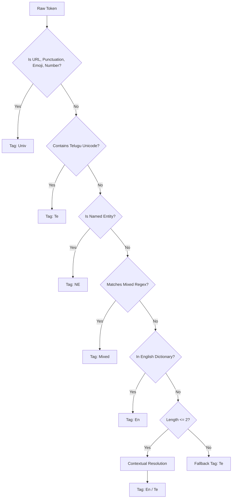

# TriMixGen – Language Annotation Design

This document formalizes the heuristic methodology for generating word-level language identification (LID) labels. This pipeline is the core research contribution of TriMixGen, designed to synthetically bootstrap a high-quality training set for our XLM-R Token Classifier.

---

## 1. Label Definitions

*   **`Te` (Telugu):** Tokens written in native Telugu script OR Latin-script representing Telugu phonetics/vocabulary (Romanized/Transliterated).
*   **`En` (English):** Standard English words, common English abbreviations, and recognized internet slang.
*   **`Univ` (Universal):** Language-agnostic tokens including punctuation, numbers, emojis, `<URL>` placeholders, `<USER>` placeholders, and standalone hashtags.
*   **`Mixed` (Intra-word Mixing):** Tokens that combine an English morphological root with a Telugu suffix/prefix (e.g., "car-lo", "vote-vey").
*   **`NE` (Named Entity):** Proper nouns, locations, organizations, and brand names, agnostic of linguistic origin.

---

## 2. Decision Hierarchy

The pseudo-labeler evaluates tokens using a deterministic cascading hierarchy. A token is classified by the first rule it matches:

1.  **Universal (Regex/Rules):** Matches digits, punctuation blocks, emojis, and placeholders.
2.  **Unicode Detection (Telugu):** Checks if the token contains characters in the `\u0C00-\u0C7F` block.
3.  **Named Entity Detection:** Checks if the token is capitalized (and not at the start of a sentence) or matches a predefined gazetteer/NER model.
4.  **Mixed Morphology Heuristics:** Matches English roots appended with standard Telugu suffixes using regex (`^[a-zA-Z]+(lo|ki|ni|lu|nunchi)$`).
5.  **English Dictionary Lookup:** Queries the token against NLTK's English words corpus (augmented with common social media slang).
6.  **Romanized Telugu Fallback:** If a Latin-script token fails the English dictionary lookup and is longer than 2 characters, it is statistically highly probable to be Romanized Telugu.
7.  **Ambiguous Tokens:** Short tokens (length $\leq 2$) that collide in both languages (e.g., "a", "O") are classified based on contextual neighbors.

---

## 3. Decision Flowchart

---

## 4. Confidence Scoring Methodology

### Confidence Calculation
Since heuristic labels are inherently noisy, each assigned label carries a confidence score $[0.0, 1.0]$.
*   **1.0**: Deterministic rules (Native Unicode, Numbers, Punctuation, Placeholders).
*   **0.9**: High-probability rules (English Dictionary match for words $>3$ chars).
*   **0.8**: Morphological heuristics (`Mixed` suffix matching).
*   **0.7**: `NE` tagging (based purely on capitalization) and Romanized `Te` (fallback).
*   **0.5**: Ambiguous short tokens resolved by context.

### Thresholds & Low-Confidence Handling
1.  **Token Level:** If a token's assigned confidence is $\leq 0.5$ (e.g., an unresolvable ambiguous token), it is tagged as `Unk` (Unknown).
2.  **Sentence Level:** The pipeline calculates the average confidence of all tokens in a sentence. If a sentence's average confidence is **$< 0.75$**, the entire sentence is discarded from the pseudo-labeled training set to prevent garbage data from poisoning the XLM-R model.

---

## 5. Conflict Resolution Rules

*   **Unicode vs English Dict:** A word like "bank" typed in Telugu script (బ్యాంకు) is handled by Tier 2 (Unicode) and tagged `Te`. Script strictly overrides semantics.
*   **English Dict vs Romanized Fallback:** A Romanized Telugu word that perfectly collides with an English word (e.g., "no", meaning "no" in English but potentially a typo in Romanized Telugu) defaults to `En` because Tier 5 (Dict) precedes Tier 6 (Fallback). This is a known acceptable loss.
*   **Named Entity vs Mixed:** If a Named Entity takes a Telugu suffix (e.g., "Hyderabad-lo"), Tier 3 (NE) generally precedes Tier 4 (Mixed). For TriMixGen, we will tag this as `NE` to preserve entity boundaries.

---

## 6. Examples for Every Label Category

| Token | Rule Matched | Tag | Confidence Score |
| :--- | :--- | :--- | :--- |
| `చాలా` | Tier 2 (Unicode) | `Te` | 1.0 |
| `bagundi` | Tier 6 (Romanized Fallback) | `Te` | 0.7 |
| `awesome` | Tier 5 (English Dict) | `En` | 0.9 |
| `car-loki` | Tier 4 (Mixed Morphology) | `Mixed` | 0.8 |
| `Mahesh` | Tier 3 (Capitalized internal) | `NE` | 0.7 |
| `1999` | Tier 1 (Universal Regex) | `Univ` | 1.0 |

---

## 7. Failure Cases and Expected Limitations

### Known Sources of Heuristic Error
1.  **Code-Mixed Slang Misses:** Slang like "lmao", "fr", "smh" might not exist in standard NLTK dictionaries. They will fall through to Tier 6 and be falsely tagged as Romanized `Te`.
2.  **Dictionary Collisions:** Short Romanized Telugu words that happen to be valid English words (e.g., "do", "me") will be falsely tagged as `En`.
3.  **Capitalization Noise:** In social media, users randomly capitalize words for emphasis (e.g., "This is AMAZING"). Tier 3 will falsely tag "AMAZING" as `NE`.

### Expected Precision and Recall
*   **`Univ` & Native `Te`:** Near 100% Precision and Recall.
*   **`En`:** High Precision (~90%), moderate Recall (misses extreme slang).
*   **Romanized `Te`:** Moderate Precision (~75%), High Recall (catches everything that falls through).
*   **`Mixed`:** High Precision (~85%), Low Recall (only catches defined suffix regexes).

---

## 8. Comparison with Alternative Annotation Strategies

| Strategy | Mechanism | Pros | Cons | Conclusion |
| :--- | :--- | :--- | :--- | :--- |
| **FastText / CLD3** | Character n-gram embeddings | Great for sentence-level LID | Fails entirely on single-word transliterated inputs | Rejected. Cannot handle token-level Romanized mixing. |
| **LLM (GPT-4)** | Zero-shot prompting | Near human-level accuracy | Too expensive, slow, API limits | Rejected. Fails local-reproducibility requirement. |
| **TriMixGen Heuristics** | Cascading decision trees | Fast, offline, interpretable | Dictionary collisions, noisy | **Accepted.** Provides a scalable "good enough" signal for neural nets to learn from. |

---

## 9. Rules for Generating the Pseudo-Labeled Training Dataset

1.  **Source:** `HOLD-Telugu` Train split.
2.  **Format:** Output to CoNLL-2003 format (`Token \t Tag \t Confidence`).
3.  **Filtration:** Drop sentences with average confidence $< 0.75$.
4.  **Balancing:** If `Te` massively outnumbers `En`, we will dynamically back-translate or upsample `En` sentences to maintain a healthy prior distribution for the XLM-R classifier.

---

## 10. Validation Strategy (Against Gold Standard)

To prove this methodology works, we will execute a rigorous validation phase *before* model training.

1.  We will run this pipeline over the 500-sentence **Manually Annotated Gold Dataset**.
2.  We will generate a **Confusion Matrix** to map heuristic outputs against human truth.
3.  We will calculate:
    *   **Token-level Accuracy:** Overall correctness.
    *   **Precision/Recall/F1-score:** Computed macro and per-class (Te, En, Mixed).
4.  **Success Criterion:** If the macro F1-score $> 0.75$, the heuristic engine is mathematically validated as a viable pseudo-label generator.
5.  **Error Analysis:** Any systematic failure (e.g., all `Mixed` tokens being tagged as `En`) will trigger a rule revision in the heuristic hierarchy.
