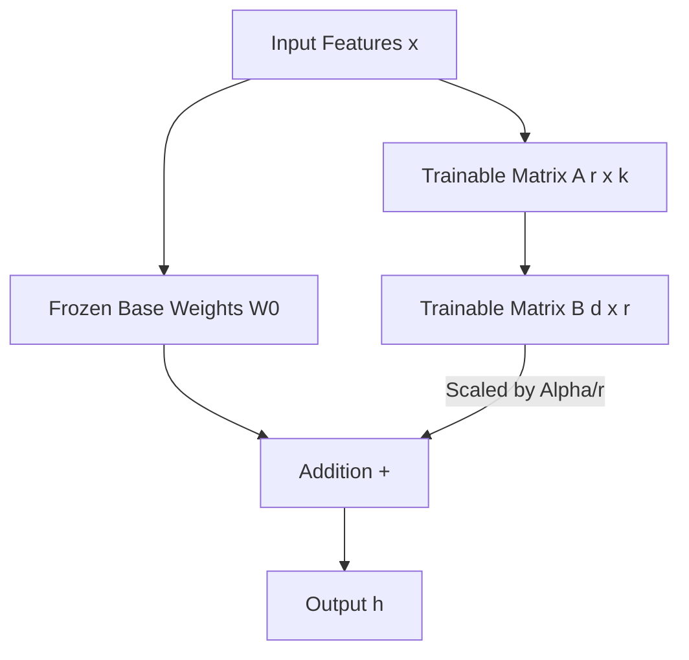

# LoRA Design & Theoretical Architecture

## Mathematical Intuition
Low-Rank Adaptation (LoRA) is based on the hypothesis that the changes in model weights required for specific task adaptation possess a low intrinsic rank. 
Instead of updating the massive original weight matrix $W_0 \in \mathbb{R}^{d \times k}$, LoRA freezes $W_0$ and injects trainable rank decomposition matrices $\Delta W = B \times A$, where $B \in \mathbb{R}^{d \times r}$ and $A \in \mathbb{R}^{r \times k}$, and the rank $r \ll \min(d, k)$.

During a forward pass, the output $h$ is computed as:
$$ h = W_0 x + \Delta W x = W_0 x + B A x $$

Because $r$ is extremely small (e.g., $r=8$), the number of parameters to train drops from $d \times k$ to $r \times (d + k)$.

## Architecture Diagram

## Trainable Parameter Analysis
For an mT5-small attention block where $d=512$, a full fine-tuning update on the query/value weights involves $512 \times 512 = 262,144$ parameters per layer.
Using LoRA with $r=8$:
- Matrix A: $8 \times 512 = 4,096$ parameters
- Matrix B: $512 \times 8 = 4,096$ parameters
- Total LoRA parameters: $8,192$ per layer.
This results in a **~97% reduction** in trainable parameters.

## GPU/CPU Memory Reduction
Full fine-tuning requires keeping massive gradient tensors, Adam optimizer states (first and second moments), and activation checkpoints in memory for *all* 300 million parameters. This requires roughly ~6GB of RAM/VRAM.
Because LoRA freezes 99% of the model, optimizer states are only tracked for the tiny $A$ and $B$ matrices. This slashes memory requirements by over 70%, allowing mT5-small to be efficiently fine-tuned on a standard laptop CPU without swapping to disk.

## Trade-offs and Limitations
**Advantages:**
1. Avoids catastrophic forgetting (base weights are untouched).
2. Extremely memory efficient.
3. Checkpoints are tiny (~3-5MB vs 1.2GB).
4. No added inference latency if matrices are merged back into base weights.

**Limitations:**
1. LoRA struggles to learn entirely new facts that aren't present in the base model (but it excels at *style adaptation* like code-mixing).
2. Determining the optimal $r$ and $\alpha$ requires careful tuning.
