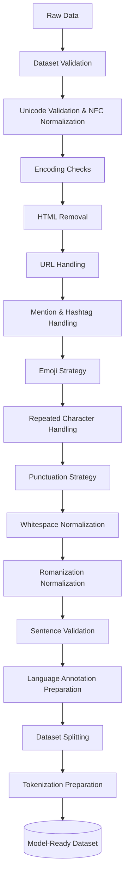

# TriMixGen – Preprocessing Pipeline Design

This document outlines the complete methodology for transforming raw, noisy code-mixed datasets into clean, model-ready formats suitable for Word-Level LID and Code-Mixed Generation.

---

## 1. Dataset-wise Analysis

### HOLD-Telugu
*   **Script Type:** Mixed (Native Telugu + Latin).
*   **Expected Noise:** Heavy slang, inconsistent transliteration, emojis, missing punctuation, URLs, user mentions, repeated characters ("looove"), HTML entities (`&amp;`).
*   **Preprocessing Requirements:** Aggressive noise reduction while strictly preserving code-mixed token boundaries. Requires Pseudo-LID tagging.
*   **Risks:** Over-normalization might destroy valid morphological code-mixing (e.g., stripping suffixes incorrectly).

### Telugu Alpaca Romanized
*   **Script Type:** 100% Latin (Romanized Telugu + English instructions).
*   **Expected Noise:** Markdown formatting, code blocks, structured JSON outputs.
*   **Preprocessing Requirements:** Markdown stripping, consistent lowercasing for generative consistency.
*   **Risks:** Stripping markdown might remove structural cues necessary for instruction-following.

### Telugu Sentiment
*   **Script Type:** 99% Native Telugu.
*   **Expected Noise:** Zero-width non-joiners (ZWNJ), inconsistent Unicode representations for complex Telugu conjuncts.
*   **Preprocessing Requirements:** Strict Unicode normalization (NFC).
*   **Risks:** Incorrect Unicode normalization can visually and semantically break Telugu ligatures.

---

## 2. Preprocessing Pipeline Flow

### Step Justifications
*   **Dataset Validation:** Ensure expected columns and types exist to prevent pipeline crashes.
*   **Unicode Validation (NFC):** Standardizes character representations (crucial for Indic scripts where consonants and vowels can be combined differently).
*   **HTML Removal:** Strips web-scraping artifacts (`&lt;`, ` `).
*   **URL & Mention Handling:** Replaces noisy URLs with `<URL>` and `@user` with `<USER>` to reduce OOV (Out of Vocabulary) token explosion.
*   **Hashtag Handling:** Removes the `#` symbol but keeps the word, as hashtags often contain critical semantic meaning in social media.
*   **Emoji Strategy:** Maps emojis to text aliases (e.g., `:smile:`) or preserves them depending on the tokenizer. We will preserve top-k emojis and map the rest.
*   **Repeated Character Handling:** Reduces "baaaaagundi" to "baagundi" (max 2 repeated chars) to reduce vocabulary sparsity.
*   **Punctuation Strategy:** Spaces out punctuation so tokenizers don't fuse punctuation with words (e.g., `hello.` $\rightarrow$ `hello .`).
*   **Whitespace Normalization:** Collapses multiple spaces/tabs into a single space.
*   **Sentence Validation:** Drops empty sentences or sentences with $< 3$ words to ensure training quality.
*   **Language Annotation:** Programmatically assigns pseudo-LID tags (detailed below).
*   **Dataset Splitting:** Stratified 80/10/10 Train/Val/Test splits.

---

## 3. Heuristic Language Annotation Pipeline

To train our XLM-R Token Classifier, we will generate pseudo-labels for the `HOLD-Telugu` corpus using a tiered heuristic algorithm:

1.  **Universal Matching (`Univ`):**
    *   *Logic:* Regex match for punctuation, numbers, URLs, `<USER>` tags, and Emojis.
    *   *Confidence:* 1.0
2.  **Unicode-Based Detection (`Te`):**
    *   *Logic:* If the token falls within the Telugu Unicode block (`\u0C00-\u0C7F`), tag as `Te`.
    *   *Confidence:* 1.0
3.  **English Dictionary Matching (`En`):**
    *   *Logic:* Query the token against NLTK's English corpus. If found (and length $> 2$), tag as `En`.
    *   *Confidence:* 0.9 (Subject to Romanized collision).
4.  **Romanized Telugu Detection (`Te`):**
    *   *Logic:* Use `fastText` LID (trained on Wikipedia) or an Indic NLP transliteration dictionary. If the token is Latin script but not in the English dictionary, calculate phonetics/n-grams. Tag as `Te`.
    *   *Confidence:* 0.8
5.  **Named Entity Handling (`NE`):**
    *   *Logic:* Capitalized words not at the start of a sentence, or matched against a Spacy/Indic NER model.
    *   *Confidence:* 0.7
6.  **Mixed-Language Tokens (`Mixed`):**
    *   *Logic:* Detect English roots combined with common Telugu suffixes (e.g., `-lo`, `-ki`, `-ni`). Regex: `^[a-zA-Z]+(lo|ki|ni|lu)$`.
    *   *Confidence:* 0.85
7.  **Ambiguous Words:**
    *   *Logic:* Short tokens ("a", "O") default to English unless surrounded entirely by Telugu tokens.

---

## 4. Tokenization Strategy

| Tokenizer | Mechanism | Best For | Recommendation |
| :--- | :--- | :--- | :--- |
| **SentencePiece (Unigram)** | Subword, direct text to id (no pre-tokenization). | Multilingual, aggressive code-mixing, missing spaces. | **mT5 (Curriculum Learning)** |
| **WordPiece** | Subword, relies on pre-tokenization (spaces). | English-heavy, strict word boundaries. | None |
| **BPE (Byte-Pair)** | Subword, merges frequent byte pairs. | Handling unknown chars, modern LLMs. | **XLM-R (LID) & Llama 3** |

*   **XLM-R (LID):** We will use XLM-R's native SentencePiece BPE tokenizer. It natively supports 100 languages and maps tokens perfectly to our heuristic labels.
*   **mT5 (Generation):** We will use mT5's Unigram SentencePiece tokenizer. Unigram is mathematically better at segmenting heavily agglutinative languages like Telugu and handles code-mixed text without explicit space boundaries.

---

## 5. Preprocessing Risks

| Step | Why it Helps | When it Hurts | Reversibility | Impact |
| :--- | :--- | :--- | :--- | :--- |
| **Repeated Chars** | Reduces vocabulary sparsity. | Destroys intended sentiment intensity ("soooo"). | **Irreversible** | High positive (LID), Low negative (Gen) |
| **URL/<USER> Replace**| Prevents OOV explosion. | Removes context of *who* is mentioned. | **Irreversible** | High positive |
| **NFC Normalization** | Fixes broken rendering. | None. | **Reversible** | Critical positive |
| **Hashtag Stripping** | Normalizes #words to words. | Loses the "metadata" semantic of the tag. | **Irreversible** | Low |

---

## 6. Modular Implementation Plan (Architecture)

The pipeline will be built inside `src/features/`:

*   `validator.py`: Asserts dataset schemas, checks for nulls, enforces minimum lengths.
*   `unicode_utils.py`: Handles NFC normalization, ZWNJ stripping, and Unicode block detection.
*   `normalizer.py`: Manages URL replacement, mention replacement, HTML stripping, and repeated character limiting.
*   `emoji_handler.py`: Regex extraction and tokenization mapping for emojis.
*   `language_annotator.py`: Implements the 7-tier heuristic logic to output `[Tokens], [Tags]` arrays.
*   `tokenizer_utils.py`: Wraps Hugging Face tokenizers to align pseudo-LID tags with subword tokens (crucial for XLM-R).
*   `preprocessing_pipeline.py`: The orchestrator class that chains the above modules together.

---

## 7. Validation Strategy

Before passing data to the models, we will validate the pipeline via:
1.  **Unit Tests (`tests/test_preprocessing.py`):**
    *   Test `normalizer` successfully converts "hiiiiii http://t.co @user" $\rightarrow$ "hii <URL> <USER>".
    *   Test `unicode_utils` properly merges broken Telugu conjuncts.
2.  **Sample Validation:** Randomly sample 50 processed sentences and print them side-by-side with raw inputs to `outputs/preprocessing/sample_validation.txt` for manual inspection.
3.  **Before/After Statistics:** Log the vocabulary size before and after repeated-character/URL normalization to quantify noise reduction.
